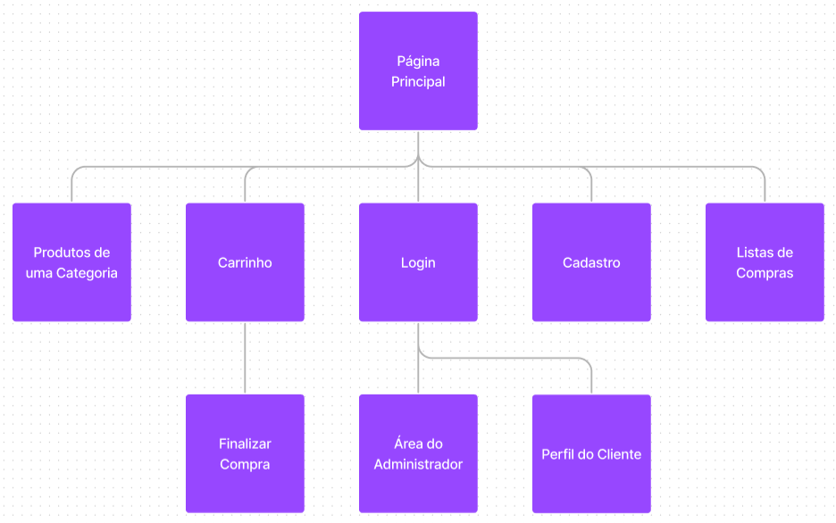

# Nosso Mercadinho

Projeto da disciplina Introdução ao Desenvolvimento Web - SCC0219.

Nosso trabalho tem como tema o desenvolvimento de um website referente a um supermercado virtual.

### Autores
| Número USP | Aluno |
| ------ | ------ |
| 11834331 | João Antônio Misson Milhorim |
| 11834432 | Marcus Vinícius Teixeira Huziwara |
| 10747562 | Thales Darini Souza |

### Índice
- [1. Requisitos](#Requisitos)  
- [2. Descrição do Projeto](#Descrição-do-Projeto)
- [3. Comentários sobre o código](#Comentários-sobre-o-código)
- [4. Plano de teste](#Plano-de-teste)
- [5. Resultados dos testes](#Resultados-dos-testes)
- [6. Building](#Building)
- [7. Problemas](#Problemas)
- [8. Comentários](#Comentários)

<a name="Requisitos"/>

## 1. Requisitos
O sistema deve ter 2 tipos de usuários: clientes e administradores.

Os administradores são responsáveis por registrar/gerenciar administradores, clientes e produtos fornecidos. O aplicativo já vem com uma conta admin com senha admin.

Clientes são usuários que acessam o sistema para comprar produtos.

O registro do administrador contém nome, CPF, telefone e e-mail.

O registro de cada cliente contém nome, CPF, endereço, telefone e e-mail.

Os registros de produto incluem nome, id, foto, descrição, preço, quantidade em estoque e quantidade vendida.

Venda de produtos: Os produtos são selecionados, são incluídos em um carrinho e sua quantidade escolhida. Os produtos são comprados usando um número de cartão de crédito (qualquer número é aceito pelo sistema). A quantidade de produto vendida é subtraída da quantidade em estoque e adicionada à quantidade vendida. Os carrinhos são esvaziados somente quando o pagamento é efetuado ou quando os clientes removem todos os produtos.

Gerenciamento de produto: os administradores podem criar/atualizar/ler/excluir novos produtos. Por exemplo, eles podem alterar a quantidade em estoque.

Nosso sistema, como funcionalidade extra, também terá listas de compras, as quais os usuários podem criar a partir de carrinhos de compras ja preenchidos com produtos. Essas listas ficam salvas, permitindo o usuário utilizá-las para realizar futuras compras de forma mais rápida e prática.

O sistema visa uma boa acessibilidade e usabilidade para seus usuários.
 
 

<a name="Descrição-do-Projeto"/>

## 2. Descrição do Projeto
Nosso Mercadinho consiste eu um supermercado virtual, no qual são vendidos produtos de ampla varieadade com um enfoque em alimentos, cuidados da casa e cuidados pessoais, como produtos de limpeza, produtos de higiene pessoal e comidas congeladas, enlatadas, in natura, dentre outras. Nosso projeto foi implementado com a linguagem de marcação HTML5, a linguagem de estilização CSS3 e foi utilizado Vue.js para o front-end. Além disso, foi utilizado Node.js para o back-end e MondoDB para o banco de dados.

### Diagrama de navegação:
Considere para o diagrama que o usuário não é capaz de acessar as páginas de Carrinho e de Listas de Compras caso não esteja logado no sistema.
 
 

Nesse repósitório existe a pasta /mockups onde estãos armazenados as imagens dos mockups do website. As imagens também podem ser acessadas através dos links abaixo:
- [Home Page](https://github.com/MarcusHuzi/Projeto-Web/blob/main/mockups/home.jpg)
- [Cadastro](https://github.com/MarcusHuzi/Projeto-Web/blob/main/mockups/cadastro.jpg)
- [Carrinho](https://github.com/MarcusHuzi/Projeto-Web/blob/main/mockups/carrinho.jpg)
- [Detalhe de Produto](https://github.com/MarcusHuzi/Projeto-Web/blob/main/mockups/detalheProduto.jpg)
- [Finalizar Compra](https://github.com/MarcusHuzi/Projeto-Web/blob/main/mockups/finalizarCompra.jpg)
- [Listagem de Produtos](https://github.com/MarcusHuzi/Projeto-Web/blob/main/mockups/listagemProdutos.jpg)
- [Lista de Compras](https://github.com/MarcusHuzi/Projeto-Web/blob/main/mockups/listasDeCompras.jpg)
- [Login](https://github.com/MarcusHuzi/Projeto-Web/blob/main/mockups/login.jpg)
- [Meu Perfil](https://github.com/MarcusHuzi/Projeto-Web/blob/main/mockups/meuPerfil.jpg)
- [Área do Administrador](https://github.com/MarcusHuzi/Projeto-Web/blob/main/mockups/AreaDoAdmin.jpg)

### Funcionalidades visadas pelo nosso site:

- Login com email e senha na plataforma, com opção de criar uma nova conta.
- Visualização das informações do cliente, com opção de atualizar dados de cadastro.
- Visualização da página de administrador, com opção de administrar os produtos e usuários da loja.
- Acesso à homepage, com visualização das categorias de produtos presentes na loja.
- Visualização de produtos pertencentes a uma categoria com opção de adicioná-los ao carrinho.
- Visualização de um modal a partir do clique em um produto contendo seu nome, descrição e valor.
- Acesso ao carrinho de compras, com opção de mudar a quantidade de itens, excluir um item do carringo, conferir o preço total, finalizar a compra e salvar uma lista a partir do carrinho para compras futuras.
- Opção de inserir informações do cartão de crédito para efetuar o pagamento.
- Opção de alterar o endereço de entrega.
- Criação de listas de compras que ficam salvas para facilitar futuras compras.

###  Informações armazenadas no servidor:

#### Contas:
- id (identificador do cliente, valor único)
- nome
- email
- senha
- admin (booleano)
- cpf
- endereço
- cep
- número de telefone
- data de nascimento

#### Produtos:
- slug (identificador do produto, string única)
- título
- categoria
- preço
- descrição
- link da imagem
- texto alternativo para imagem
- quantidade em estoque
- quantidade vendida do produto
- ativo (booleano)

#### Listas de compras:
- email (do usuário o qual a lista pertence)
- nome
- produtos (cada um com seu slug e sua quantidade)

<a name="Comentários-sobre-o-código"/>

## 3. Comentários sobre o código
As páginas foram feitas utilizando-se HTML5, CSS3 e Vue.js. O código para o servidor e banco de dados está na pasta server, separado do código para o cliente Vue, que está na pasta site.
 
 

<a name="Plano-de-teste"/>

## 4. Plano de teste
Os testes foram feitos no próprio navegador ao longo de todo o desenvolvimento, visando testar a integridade estrutural das páginas, as funcionalidades implementadas e a integração com o banco de dados. Ademais, foi utilizada a plataforma Insomnia para testar as requisões do CRUD.
 
 

<a name="Resultados-dos-testes"/>

## 5. Resultados dos testes
Os testes feitos auxiliaram tanto a encontrar e resolver bugs quanto a melhorar o visual e interatividade do site. Na entrega final, não encontramos bugs que afetassem significativamente a experiência do usuário e o site apresentou comportamento satisfatório de acordo com os requisitos.
 
 

<a name="Building"/>

## 6. Building
É necessário ter o `npm` e o `node.js` instalados e estar dentro do diretório `milestone3`. O front-end e o back-end (o site e o servidor) serão executados localmente, enquanto que o banco de dados está hosteado num servidor de mongodb.

Para rodar o servidor:
- `cd server`
- `npm install`
- `npx nodemon ./bin/server.js`

Para abrir o site:
- `cd site`
- rodar `npm install`
- rodar `npm run serve`
- o programa, no terminal, indicará em qual localhost está sendo executado
- basta acessá-lo no navegador de sua preferência.

Para acessar a visão de usuário comum sem a necessidade de fazer o cadastro de uma nova conta use o email `email@email.com` e senha `12345`.
Para acessar a visão de Administrador, deve-se efetuar o login com email `admin@admin.com` e senha `admin`.
 
 

<a name="Problemas"/>

## 7. Problemas
O maior desafio foi aprender tantas tecnologias diferentes e ter que integrá-las todas no projeto, principalmente, pelo fato de nosso grupo não possuir experiência prévia com elas. Outra grande dificuldade foi adaptar toda a parte do Vue que estava pronta no milestone 2 para ser usada com o banco de dados, visto que muitas funcionalidades tiveram que ser refeitas.
 
 

<a name="Comentários"/>

## 8. Comentários
Alguns dos frameworks/ferramentas usados pelo grupo foram:
- Figma (para os mockups)
- Vue.js (front-end)
- Mongoose (integração entre o banco de dados e o servidor)
- Studio 3T (para a visualização do banco de dados)
- Insomnia (para simular requisições HTTP)
